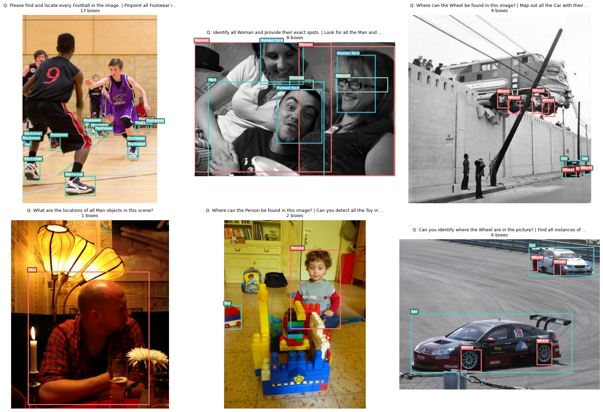

# Nemotron VLM v2 OI BBox: Recaptioning Plan & Pipeline

## 1. Dataset Overview

**Source:** `gs://cohere-data/vision/agent_trajectory/v4_filtered/uncompressed/nemotron_vlm_v2_oi_bbox_2_v1/`



| Property | Value |
|----------|-------|
| Total samples | 1,664,533 |
| Total turns | 8,419,602 |
| Avg turns/sample | 5.1 |
| Shards | 1024 (`.jsonl`) |
| Images per sample | 1 (base64 JPEG embedded in turn 0) |
| Bbox format | `[x1, y1, x2, y2]` integers in [0, 1000] |
| Source annotations | OpenImages V7 detection labels (600+ categories) |

### 1.1 Bbox quality assessment

**Geometry (25,440 bboxes sampled from 2 shards):**
- All coordinates are integers in [0, 1000] -- no normalization needed.
- 0 inverted boxes (x2 < x1 or y2 < y1), 0 degenerate, 0 zero-dimension, 0 duplicates within turns.
- Count consistency: 100% -- every time the response claims "there are N", there are exactly N bboxes.

**Size distribution:**
- Median area: ~16,600 (~1.7% of image). Mean: ~88,500 (right-skewed, normal for detection).
- 0.9% tiny (area < 100): sub-10px annotations of distant objects. Consider filtering area < 200.
- 1.1% near-full-image (area > 900k): objects that fill the frame. Top categories: Building, Man, House.

**Semantic quality:**
- Multi-bbox responses are common: ~52% have 1 bbox, ~19% have 2, the rest have 3-153.
- Cross-turn bbox overlap is very low (0.45%), confirming different turns target genuinely different objects.
- OpenImages hierarchical labels cause frequent co-occurrence of e.g. "Man" + "Human face" + "Clothing" on the same image. Requires care during counting task generation.

**Verdict: bboxes are high quality and can be reused as-is.**

### 1.2 Current format issues (why we need recaptioning)

1. **Special tokens**: Uses `<ref>Object</ref>:<box>[x1, y1, x2, y2]</box>` -- must be converted to `<|box_start|>[x1, y1, x2, y2]<|box_end|>` and `<ref></ref>` must be removed.
2. **Grammar errors** (~20% of responses): "there are 1 Man", "Here are their positions" for singular items, awkward category-name pluralization.
3. **Question monotony**: All ~25 question templates ask the same thing (text -> bbox localization). No reverse-direction or counting tasks.
4. **No reasoning traces**: Responses jump straight to the answer with no `<START_THINKING>...<END_THINKING>` block.
5. **Conversion to single-turn**: We will consolidate the current multi-turn QA as meta-data to generate a single question-answer pair per turn.

> ❗️ Point 5 is debatable. We could keep the multi-turn format, and for example generate multiple turns by generating each task instead of sampling 1 task per sample. I think multi-turn makes sense if we want to train the model having a longer context window with multiple related questions about the same image. In terms of data, I think we have more than enough samples to not require reusing the same image for multiple tasks.

---

## 2. Recaptioning Goals

Since the bboxes are already high quality and in the correct [0, 1000] format, we skip coordinate harmonization and object identification (steps 1+2 of the general recaptioning plan). We proceed directly to Q+A generation.

Each turn is randomly assigned **exactly one** of three task types, reusing the existing bboxes and category labels as ground truth. Every assistant response includes a reasoning trace.

---

## 3. Task Types

### Task A -- Grounding (text -> bbox)

The user asks "Where is the X?" and the model responds with bboxes.

**Changes from original:** Fix grammar, replace special tokens, add reasoning trace, vary question phrasing.

**Example:**

```
User: Where are all the flowers in this image?
Chatbot: <START_THINKING>I need to locate all instances of flowers in the image. I can
see two flowers -- one near the center-left area and another toward the upper-right
corner.<END_THINKING>
I found 2 flowers in this image:
1. <|box_start|>[463, 488, 528, 631]<|box_end|>
2. <|box_start|>[818, 198, 852, 293]<|box_end|>
```

### Task B -- Recognition (bbox -> text)

Provide the bboxes in the question and ask the model to identify what they contain. The current category labels serve as ground truth for validation.

**Example:**

```
User: What objects are located at <|box_start|>[463, 488, 528, 631]<|box_end|> and
<|box_start|>[818, 198, 852, 293]<|box_end|>?
Chatbot: <START_THINKING>Examining the first region, I can see a pink flower in bloom.
The second region contains a small white flower bud near the top-right of the
image.<END_THINKING>
The objects at the specified locations are:
1. <|box_start|>[463, 488, 528, 631]<|box_end|> -- A pink flower in bloom.
2. <|box_start|>[818, 198, 852, 293]<|box_end|> -- A small white flower bud.
```

### Task C -- Counting (derived from detection annotations)

Inspired by [STEP3-VL-10B](https://arxiv.org/abs/2601.09668) ("counting data constructed by converting high-quality object detection annotations into counting formulations") and [Qwen3-VL](https://arxiv.org/abs/2511.21631) (direct counting, box-based counting, point-based counting).

Three sub-formulations:

**C1 -- Direct counting:** "How many X?" -> count only, no bboxes.

**C2 -- Box-based counting:** "How many X? Show their locations." -> count + bbox list.

**C3 -- Verification counting:** "Are there more than N X?" -> yes/no + actual count.

---

## 4. Task Distribution

Each `(image, category, bboxes[])` turn is randomly assigned exactly one task type:

| Task | Weight | Eligibility | Notes |
|------|--------|-------------|-------|
| A -- Grounding (text->bbox) | 35% | All turns | Fix grammar + add reasoning. |
| B -- Recognition (bbox->text) | 35% | All turns | Reverse direction. |
| C -- Counting | 30% | All turns (see fallback) | Mix of C1/C2/C3. |

**Single-bbox fallback:** When a turn is assigned Task C but has only 1 bbox:
- 80% -> fall back to A or B.
- 20% -> keep as C (counting with count=1, e.g. "Is there more than one X?" -> "No, there is exactly 1.").

**Estimated final dataset size:** ~4.2M single-turn conversations (one per original turn).

---

## 5. Pipeline Architecture

```
JSONL Shard --> Parser --> Task Assigner --> Prompt Builder --> Qwen VLM API --> Validator --> Output JSONL
```

### 5.1 Flow

1. **Extract**: Read a JSONL shard, parse each sample's turns into `(image_b64, image_meta, category, bboxes[])` triples.
2. **Assign**: Deterministically assign a task type (A/B/C1/C2/C3) per turn, seeded by `(sample_id, turn_index)` for reproducibility.
3. **Build prompt**: Call the task-specific prompt function. Each function returns `(system_prompt, user_message)` -- the Qwen model only sees the prompt for its assigned task.
4. **Inference**: Send image + messages to the Qwen VLM API (OpenAI-compatible chat completions).
5. **Validate**: Check the model output (bbox tokens, thinking tags, count consistency, bbox fidelity). Retry once on failure, then discard.
6. **Write**: Emit a single-turn conversation to the output JSONL.

### 5.2 File structure

```
nemotron_recaptioning/
  config.py          # Tunables: API endpoint, model name, task weights, concurrency, paths
  parser.py          # Extract (image_b64, image_meta, category, bboxes) from raw JSONL
  task_assigner.py   # Deterministic random task assignment (40/30/30 + fallback)
  prompts.py         # 5 prompt-builder functions (A, B, C1, C2, C3)
  api_client.py      # Async wrapper for Qwen VLM API with retry logic
  validator.py       # Per-task output validation
  pipeline.py        # Main orchestrator: shard iteration, async concurrency, CLI
```

### 5.3 Key module: `prompts.py`

Five functions, one per task variant. Each receives the structured metadata and returns the messages list. The model never sees prompts for other task types.

```python
def build_prompt_grounding(image_b64, category, bboxes, image_meta):
    """Task A: text -> bbox. Returns (system, user_msg)."""

def build_prompt_recognition(image_b64, category, bboxes, image_meta):
    """Task B: bbox -> text. Returns (system, user_msg)."""

def build_prompt_counting_direct(image_b64, category, bboxes, image_meta):
    """Task C1: direct count. Returns (system, user_msg)."""

def build_prompt_counting_boxed(image_b64, category, bboxes, image_meta):
    """Task C2: count + list bboxes. Returns (system, user_msg)."""

def build_prompt_counting_verification(image_b64, category, bboxes, image_meta):
    """Task C3: yes/no threshold question. Returns (system, user_msg)."""
```

### 5.4 Key module: `task_assigner.py`

```python
def assign_task(sample_id: str, turn_index: int, num_bboxes: int) -> str:
    """Returns one of: 'A', 'B', 'C1', 'C2', 'C3'.

    - Draw from {A: 0.4, B: 0.3, C: 0.3}
    - If C and num_bboxes >= 2: sub-draw C1/C2/C3 uniformly
    - If C and num_bboxes < 2: 80% fallback to A, 20% keep as C (C1 or C3 only)
    - Deterministic seed from (sample_id, turn_index) for reproducibility
    """
```

### 5.5 Key module: `validator.py`

Per-task validation rules:

| Check | A | B | C1 | C2 | C3 |
|-------|---|---|----|----|-----|
| `<START_THINKING>...<END_THINKING>` present | Yes | Yes | Yes | Yes | Yes |
| No legacy `<ref>` / `<box>` tags | Yes | Yes | Yes | Yes | Yes |
| All GT bboxes in answer (exact match) | Yes | -- | -- | Yes | -- |
| Bboxes from question echoed in answer | -- | Yes | -- | -- | -- |
| Count in answer matches GT | -- | -- | Yes | Yes | Yes |
| No bboxes in answer | -- | -- | Yes | -- | -- |
| Yes/no consistent with count vs threshold | -- | -- | -- | -- | Yes |

Failed validation: retry once with the same prompt, then discard.

### 5.6 Pipeline execution

- Processes one shard at a time (or a range via CLI).
- Uses `asyncio` + `httpx` for concurrent API calls (configurable, e.g. 64 in-flight).
- Writes one output JSONL per input shard.
- Logs progress: shard number, turns processed, pass/fail/retry counts.
- CLI: `python pipeline.py --shards 0-100 --api-url http://... --concurrency 64 --output-dir /path/`

### 5.7 Output format

Each output line is a single-turn conversation:

```json
{
  "image_b64": "...",
  "image_meta": {"width": 1024, "height": 768},
  "task_type": "C2",
  "source_id": "5747db47-...",
  "source_turn_index": 0,
  "category": "Flower",
  "ground_truth_bboxes": [[463, 488, 528, 631], [818, 198, 852, 293]],
  "conversation": {
    "turns": [
      {"role": "User", "content": [{"type": "image"}, {"type": "text", "text": "..."}]},
      {"role": "Chatbot", "content": [{"type": "text", "text": "<START_THINKING>...<END_THINKING>\n..."}]}
    ]
  },
  "validation_passed": true
}
```

Metadata fields (`task_type`, `source_id`, `ground_truth_bboxes`) are kept for debugging/filtering and stripped in the final assembly step.

---

## 6. Qwen Prompts (Full Text)

### 6.1 Task A -- Grounding: System Prompt

```
You are an expert visual grounding assistant. You will be shown an image along with an
object category and the ground-truth bounding boxes for all instances of that category.

Your job is to produce a high-quality, natural-sounding grounding conversation turn
consisting of:
1. A USER question asking where the object(s) are in the image.
2. A CHATBOT answer that first contains a reasoning block enclosed in
   <START_THINKING>...</END_THINKING>, and then lists the bounding boxes.

Rules:
- The bounding boxes are given to you as ground truth in normalized [0, 1000] format.
  You MUST use them exactly as provided -- do not change, reorder, or invent any
  coordinates.
- Wrap every bounding box with the special tokens:
  <|box_start|>[x1, y1, x2, y2]<|box_end|>
- Do NOT use <ref></ref> or <box></box> tags.
- The reasoning block should describe what you observe in the image that leads you to the
  answer. Be specific about visual appearance, position, and context. Keep it concise
  (2-4 sentences).
- Vary the question phrasing naturally. Do not always use the same template.
- Use correct English grammar. Pay attention to singular vs. plural agreement.
- When the category name is a compound noun (e.g., "Human face", "Land vehicle"), use
  natural phrasing in the question.
```

### 6.2 Task B -- Recognition: System Prompt

```
You are an expert visual recognition assistant. You will be shown an image along with one
or more bounding box regions and the ground-truth category label for those regions.

Your job is to produce a high-quality, natural-sounding recognition conversation turn
consisting of:
1. A USER question that provides the bounding box coordinates and asks what objects are
   at those locations.
2. A CHATBOT answer that first contains a reasoning block enclosed in
   <START_THINKING>...</END_THINKING>, and then describes what is found at each location.

Rules:
- The bounding boxes are given in normalized [0, 1000] format. Wrap every bounding box
  with: <|box_start|>[x1, y1, x2, y2]<|box_end|>
- Do NOT use <ref></ref> or <box></box> tags.
- The user question should embed the bounding boxes and ask about their contents.
- In the reasoning block, describe what you actually see in each region of the image --
  appearances, colors, context, spatial relationships. Be specific and visually grounded.
  Keep it concise (2-4 sentences).
- The final answer should identify each object with a brief natural-language description
  that goes beyond just repeating the category name. Mention distinctive visual attributes
  (color, size, pose, material, etc.) where possible.
- Use correct English grammar throughout.
- The descriptions must be consistent with the ground-truth category label provided.
  Do not contradict it.
```

### 6.3 Task C -- Counting: System Prompt

```
You are an expert visual counting assistant. You will be shown an image along with an
object category, the ground-truth count, and the ground-truth bounding boxes for all
instances.

Your job is to produce a high-quality, natural-sounding counting conversation turn. You
will be told which counting sub-type to generate:

- C1 (Direct counting): The user asks how many X are in the image. The answer gives the
  count only (no bounding boxes).
- C2 (Box-based counting): The user asks how many X are in the image and requests their
  locations. The answer gives the count and lists all bounding boxes.
- C3 (Verification counting): The user asks a yes/no question about whether there are
  more/fewer than N instances. The answer confirms or denies and gives the actual count.

Rules:
- The count and bounding boxes are ground truth. You MUST use them exactly -- do not
  change the count or invent/omit any bounding boxes.
- Wrap every bounding box with: <|box_start|>[x1, y1, x2, y2]<|box_end|>
- Do NOT use <ref></ref> or <box></box> tags.
- Every answer must start with a reasoning block enclosed in
  <START_THINKING>...</END_THINKING>. The reasoning should walk through the counting
  process. Keep it concise (2-4 sentences).
- For C3, vary the question format:
  - "More/fewer than N": pick N = count +/- random(1,3) so the answer is not always
    the same direction.
  - "Exactly N": pick N = count (answer: yes) or N = count +/- random(1,3) (answer: no).
  Mix these roughly equally to produce harder, more diverse verification examples.
- Vary question phrasing naturally.
- Use correct English grammar with proper singular/plural agreement.
```

### 6.4 User Message Template (all tasks)

```
Image: {image}

Category: {category}
Number of instances: {count}
Ground-truth bounding boxes (normalized [0, 1000]):
{bbox_list}
Task type: {A|B|C1|C2|C3}

Generate a natural Q&A turn. Output strictly in this JSON format:
{
  "question": "...",
  "answer": "<START_THINKING>...<END_THINKING>\n..."
}
```

### 6.5 Constraining the output

- Tasks A and C: bboxes are hard-constrained. The prompt provides them as ground truth and instructs the model to copy them verbatim. Post-processing verifies with regex matching.
- Task B: bboxes appear in the user question (not generated by the model), so they are inherently constrained. The model's category description is soft-validated against the ground-truth label.

---

## 7. Tracking

| Step | Status |
|------|--------|
| Inspect data & assess bbox quality | DONE |
| Write recaptioning plan | DONE |
| Write Qwen recaptioning prompts | DONE |
| Implement pipeline code | TODO |
| Test end-to-end on sample shard | TODO |
| Run full recaptioning (1024 shards) | TODO |
| Quality filtering pass | TODO |
| Final assembly into multimodal_ift | TODO |

---

## 8. Open Questions for Discussion

1. **Tiny/huge bbox filtering**: Should we filter out tiny boxes (area < 200) and/or full-image boxes (area > 900k) before recaptioning, or keep them and let the model handle them?
2. **Hierarchical category handling**: When the same image has turns for both "Person" and "Man", should we suppress counting tasks for the parent category ("Person") to avoid confusion?
3. **Reasoning trace depth**: Should reasoning be 2-4 sentences (current plan) or shorter/longer? Longer reasoning costs more tokens but gives richer training signal.
4. **Task weight tuning**: The 40/30/30 split is a starting point. Should we adjust after inspecting a pilot batch (e.g. if counting turns out lower quality)?
